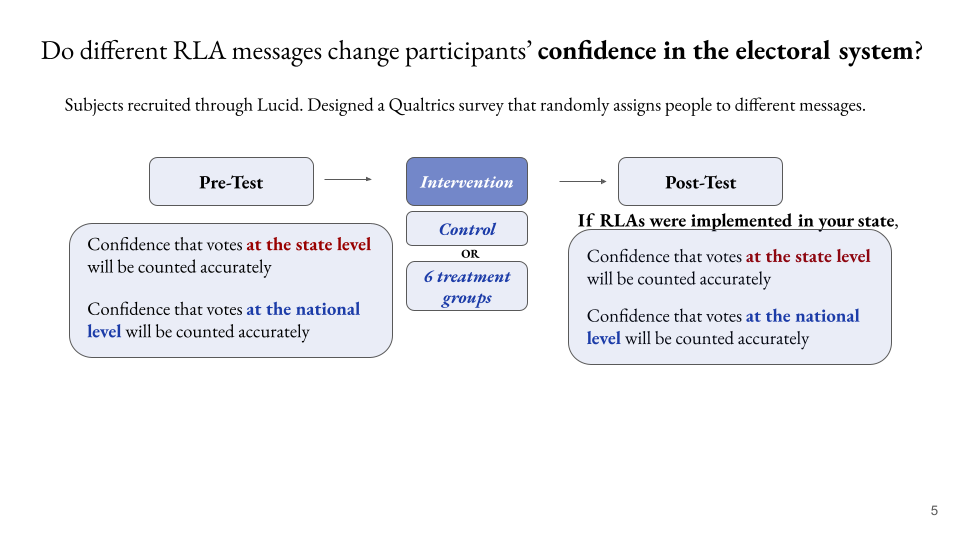

<style>
div.blue { background-color:#e6f0ff; border-radius: 5px; padding: 20px;}
</style>

<style>
div.medblue { background-color: #b3d1ff; border-radius: 5px; padding: 5px;}
</style>

<style>
div.darkblue { background-color: #9ac2ff; border-radius: 5px; padding: 5px;}
</style>


```{r setup, include = FALSE}
set.seed(95126)
knitr::opts_chunk$set(
  eval = TRUE,
  echo = TRUE,
  warning = FALSE,
  message = FALSE
)

library(png)
library(grid)
```


---

## Motivation

Colorado’s unique election system is often referred to as the “gold standard for the nation" and has some of the highest voter turnout rates in the country. Since 2013, all registered voters in the state receive their ballot in the mail and have a variety of ways to return it (via mail, drop box, or in person). In 2017, Colorado became the first state to use a security feature, Risk-Limiting Audit (RLA), to check and verify electoral results.

While many academics, NGOs, and election officials view RLAs as an ideal way to confirm the integrity of the election and final vote count, the RLA process is often challenging to convey to the general public. Communicating the importance and security of RLAs is critical, particularly as other states are looking to implement RLAs in future elections.


The partners for this project are the Colorado State government office and a cross-disciplinary group at Stanford, including researchers and policy experts at the Stanford Internet Observatory, that studies abuse of information technologies and develops a curriculum on trust and safety.

The goal of this project is to learn about the effective means to communicate the RLA technology to the public, and improve public trust in the election process. To achieve this goal, the project team will design an experiment with experts on RLAs. This project would directly inform election policy across the country, enabling election officials to rebuild voter confidence in the integrity of elections. The group will test the effectivness of several interventions to increase confidence in using RLAs to verify election results, including different messages to convey why RLAs ensure integrity in the election from different credible messengers (e.g. teacher, judges). Our outcome of interest will be trust in the individual's State election results from learning about RLAs. Individuals do not need to understand or know about RLAs already.

We believe that the insights gleaned from this experiment will both contribute to generalized knowledge about how to increase confidence in elections, and RLAs in Colorado, and provide a path for other states besides Colorado to implement, and market, RLAs to their constituents.

---

## Research Questions

* Does informing voters about RLAs increase their confidence in the election system?

* If so, which messages about RLAs are the most effective at increasing voters’ confidence in the integrity of the election results? 

* Do different strategies work better for different subgroups? Are there heterogeneous treatment effects?

---

## Experimental Setup *UPDATE*

_Describe how the research question can be answered with an experiment, comment on the methodology used. For example, argue why a randomized experiment is useful to answer the research question._

_This section should be a "how-to" guide for executing your experiment. In theory, someone should be able to execute your experiment after reading this section._

The research question can be answered using an experiment to test the efficacy of different messages on increasing confidence in election systems by providing information about RLAs through a series of survey questions.

We will use seven different messages with a pre- and post-test question to gauge the effect of the message. We will have one control group and six different messages to use on different treatment groups. The control group will receive a message about election integrity, with no mention of RLAs. The three treatment groups will each receive a different message about RLAs of similar length and reading level.

Our pre-test questions will gather covariates to get a sense of participant's trust in government and civic engagement. Participants will first answer survey questions about confidence in elections for our pre-test dependent variables. Next, we will gather covariates around the participant's level of trust in government at the state and federal levels, and trust in recent presidential elections. After a page break, there will be basic demographic questions for covariates (race, gender, income, etc.). On the following page, participants receiving one of the six treatment messages will view a page explaining how RLAs work to ensure everyone receives the same information. The participant will then be presented with one of the seven messages (Control or treatment message). 

After receiving the treatment, all participants will be asked post-test questions on their confidence in state and national elections. This will be followed by additional questions on covariates like political ideology, citizenship, education, civic engagement. These will be useful covariates to analyze our data, gauge political attitudes, and measure the effect of messages for subgroups. By asking these questions after the treatment, we aim to reduce the influence of asking questions about an individual's ideology on the pre-test. This design is a between-subject design, where interventions are implemented at the respondent level.

### Sample recruitment

Participants will be recruited through Lucid during the first half of May 2021, which allows us to target a representative sample of US adults (18 years old and up). Our target sample size is 200 respondents for each treatment group, totaling 1600 respondents across all 50 states.

Apart from Colorado, several other states have recently or are planning to use RLAs in the future and the goal of using a nationally representative sample is to gain generalizable insights about the potential benefits of well-communicated information about RLAs on voter confidence in the election.

### Treatment (Nate is going to fill this in)

_Please explain your experimental interventions in detail here. Please include a flow chart/diagram that helps explain to readers your experimental setup and procedure._

_You should provide details for each treatment arm here. Remember, visuals help! You can provide images or screenshots of what the actual experiment will look like to participants._

_You should also provide the rationale for choosing the treatment arms._

Drawing on the literature on experimental interventions around election processes, we use a treatment message designed to explain how RLAs work at the respondent level. This will allow us to measure if receiving information increases confidence in elections. The treatment message use rational and emotional appeals, grounded in real-world analysis around trust in elections (e.g. that voters trust their local election officials). The treatments are presented in Table 1.

All respondents are assigned either the Control message or one of the six treatment messages. The messages are all of similar length and reading level. The treatment process is detailed in Figure 1. 

<center>
**Table 1**
</center>

| Shorthand Name | Treatment Level | Treatment 
|:----:|:----:|:----:|
| 1. Bipartisan Auditors | Respondent | Prompt: Did you know? The RLA process is balanced. Republican and Democrat representatives audit your state's election system. This means that, when a random sample of votes is being checked for any miscounts, representatives from both parties review the process and sign the final results.  | 
| 2. Risk Limit as a Percentage | Respondent | Prompt: Did you know? Before starting an audit, election officials agree on a risk limit. The lower the risk limit, the more ballots need to get recounted to verify the election result. If the originally reported election result is wrong, then, a risk limit of 5% means that there's a 95% chance the risk-limit audit will find the mismatches and correct the result.  | 
| 3. Risk Limit as a Guarantee Beyond a Reasonable Doubt | Respondent | Prompt: Did you know? Before starting an audit, election officials agree on a risk limit. The lower the risk limit, the more ballots need to get recounted to verify the election result. If the originally reported election result is wrong, then the risk limit we recount enough ballots to verify, beyond a reasonable doubt, the outcome of the election. |
| 4. Emotional - Politicians are Bad Losers | Respondent | Prompt: Did you know? Every four years, the losing politician only has one move left to make – cast doubt on the election process.  We are tired of this bullshit! Don’t confuse election officials with politicians, and don’t fall for politician’s snake-tongued tricks. Our election system is safe, respected, and triple-checked. | 
| 5. Random Sample (Soup Analogy) | Respondent | Prompt: Did you know? A small sample of ballots can be used to confirm election results for the entire state. How? Well, it's similar to tasting a giant pot of soup to see if it's too salty. All you need to do is stir the pot thoroughly and take a random sample — a spoonful of soup. Similarly, election officials keep records of every single vote cast. To verify the election results, they randomly select certain ballot and recount each vote. |
| 6. RLAs are Run by Local Election Officials | Respondent | Prompt: Did you know? Local election officials are your neighbors; they are the people you see at the store, soccer games, and church. How dare politicians insult the heroes of our election process? Local election officials are the ones counting votes, not some distant politician. We built the election system this way on purpose - to throw out politicians when we have had enough of them. |
| 7. Control  | Respondent | Prompt: Did you know? Elections are at the heart of democracy. Voting in an election gives the people a way to choose who governs them. The election process provides a way for power to be transferred peacefully. It is important that people who work in elections serve the American people to protect our democracy.

<center>Table 1. Description of interventions included in the experiment</center>

<center>


```{r treatment message images, echo=FALSE}
library(gridExtra)
img <- readPNG("Figures/rla_intro.png")
img1 <- readPNG("Figures/control.png")
img2 <- readPNG("Figures/treat_1.png")
img3 <- readPNG("Figures/treat_2.png")
img4 <- readPNG("Figures/treat_3.png")
img5 <- readPNG("Figures/treat_4.png")
img6 <- readPNG("Figures/treat_5.png")
img7 <- readPNG("Figures/treat_6.png")
grid.arrange(img, img1, img2, img3, img4, img5, img6, img7, ncol = 4)
```


### Outcomes

_How will you measure and analyze both primary and secondary outcomes of interest? How do they help you address the research questions?_
We use a pre-test / post-test design. Prior to treatment, we show respondents four media posts from their country (two true and two false in random order) randomly sourced from our stimuli set. For each stimulus, we ask the above self-reported sharing intention questions. Respondents are then asked a series of questions about their media consumption, and are then randomly assigned treatment according to the experimental design. If assigned to one of the respondent level treatments, they are administered the relevant treatment. 

They are then shown four additional stimuli (two true and two false), selected from the remaining stimuli that they were not shown pre-treatment. If the respondent is assigned a headline-level treatment, this treatment is applied only to the misinformation stimuli, as flags and fact-checking labels are not generally applied to true information from verified sources. For each of the stimuli
we again ask the same self-reported sharing intention questions.


#### Primary Outcomes

We will use a pre-test/post-test design to address our primary research question:

(1) Does communicating about RLAs increase trust in election system for the US adult population?

Prior to treatment, respondents will be asked to rate on a scale (1-10) their confidence in election processes at the state and national level. After answering this question, along with select covariates, respondents will be randomly assigned to either the Control or one of the six treatment groups to read a message. If treated, they will receive a message about RLAs, whereas the Control group will receive a message about elections but with no reference to RLAs. Respondents will then be asked to answer the same question about confidence in election processes at the state and national level, along with other covariates that are related to elections (e.g. party affiliation). 

The primary outcome we are interested in is determining a change in confidence in election processes after being treated. We will measure the dependent variables by taking the difference in means between the pre- and post-test dependent variables, measured on a scale of 1-10, to see if there is a noticeable change between the Control and treatment messages. 

By running a two-sided T-test, we will be able to determine if talking about RLAs positively or negatively impacts voter confidence. Through this, we will be able to compare the treatment groups to the Control based on the average change in pre- and post-test ranking about confidence in voting at the state and national level.

The survey questions that will allow us to measure this change are two-fold to account for differences in confidence at the state versus national level, all measured on a scale (1-10).

*Pre-Treatment Questions*
(1) How confident are you that votes in your state will be counted accurately in the upcoming 2024 presidential election?

(2) How confident are you that votes across all states will be counted accurately in the upcoming 2024 presidential election?

*Post-Treatment Questions*
(1) Given what you know about election processes, how confident are you that votes in your state will be counted accurately in the upcoming 2024 presidential election?

(2) Given what you know about election processes, how confident are you that votes across all states will be counted accurately in the upcoming 2024 presidential election?

The pre-test/post-test design will allow us to measure the average treatment effect compared to the Control, whether positive or negative.

Because of random assignment, we expect to see no systematic differences in pre-test confidence levels across treatment groups, conditional on covariates.

#### Secondary Outcomes

In addition, we measure secondary outcomes by comparing the effectiveness of each treatment against each other to see which message is more effective. We will run a multiple hypothesis test between each treatment group to determine this marginal treatment effect. We will also examine the effect for particular sub-groups.

The secondary research questions we are most interested in is:

(2) Which messages about RLAs are the most effective at increasing trust in elections?

To explore this question, we will compare the treatment groups to each other to determine which message is most effective. We will pursue this by using a linear regression model to compare each message's coefficient with that of the Control. 
 
Finally, after receiving the treatment or Control, respondents will be asked the following question measured on a scale (1-5):

(3) Given what you know about election processes, how confident are you that votes across all states will be counted accurately in the upcoming 2024 presidential election?

This question is intended to capture a secondary effect from being treated (or not treated). We will use this secondary effect as the outcome variable in a linear regression to determine respondents self-reported change in trust.

### Covariates

The existing literature on election integrity focuses on voter confidence in specific elections (Atkeson et al., 2015), the role of partisanship (Sances et. al, 2015), and factors that can drastically affect voter experiences like poll workers (Hall et al., 2009). Our study contributes to the existing literature by exploring what messages are most effective at explaining RLAs and building trust and confidence in election systems. What messages are most salient with US adults to understand and trust that their vote was accurately counted? 

In addition to the demographic covariates such as age, race, gender, and education, we also include specific questions regarding party affiliation, political ideology, and trust in state and federal government. This includes a control for people with strong or unwavering views on election integrity for us to measure the treatment effect. 

These variables capture what might be sources of heterogeneity in responses
to RLAs and election integrity: age, education, religious views, and political ideology, and trust in government. We will control for these covariates in the primary regression, and will examine the heterogeneous treatment effects based on sub-groups, such as age, race, and gender. Results from collecting these covariates could help our partner and other organizations target messaging based on the population.

---

## Hypotheses

_Discuss how you would map the research questions into testable hypotheses. For example, if your goal is to find some prototypes for further exploration, which kind of test would you want to conduct? If your goal is to figure out if an intervention works better for one specific group, how would you formulate the hypothesis?_

_How do you plan to address the problem of multiple hypotheses testing? If you are making a final recommendation rather than selecting some for future exploration, you might want to choose the more conservative correction methods._

**Primary:**

The primary hypothesis that we are interested in testing the change in voter confidence after the intervention to measure whether any of the treatments to communicate about RLAs are effective in increasing voter trust in election systems. This compares the treatment to the Control group.

We hypothesize that being treated with any of the six messages will have a positive effect compared to the Control group. In addition, given that we are measuring confidence in state and national elections, we expect the treatment effect will be smaller at the national level than state level given prior research showing that voters trust elections in their vicinity.

**Secondary (Hypotheses to inform industry practice)**
Our secondary hypothesis will measure which of the six messages were most effective, comparing the treatments to each other. We expect that learning about RLAs will have at least a small positive effect on trust in election systems, and that the Bipartisan message and Bad Loser, the emotional appeal, will have the largest effects compared to the other treatments. In addition, we anticipate the message about RLA as a percentage will have a neutral or negative effect on confidence in election processes.

We care about the outcome (increasing voter confidence) and understanding which types of people are nudged toward this outcome by particular treatments. Therefore, we plan to examine how a few select treatments interact with particular covariates of interest, namely age, gender, party affiliation, income, and education.

For low-income and low-educated participants, we expect the message about RLAs with the percentage will have a negative effect. For those that identify as Republicans, the message "Bad Losers" will be less effective. Respondents that identify as Republicans will be less affected overall by the treatments than those identifying as Democrats. In addition, respondents with low trust in the government (state or national) will be effected less than those with high trust in the government. 

We designed treatments based one existing research on what increases, or decreases, confidence in election processes. The below covariates were selected based on what surveys and social media companies collect, which could be used for targeting interventions. For our covariates of interest, we will divide these into two groups for binary variables (i.e. female, race, parent, eduction). We will split on the median value for continuous variables (i.e. age).

Treatments (respondent-level):

* Bipartisan Auditors 
* Risk Limit as a Percentage
* Hand-Counted Votes
* Politicians as Bad Losers
* Random Sample Soup Analogy
* Local Election Officials
* Control 

Covariates: 

* Age
* Gender
* Race
* Income
* Education
  + High school education
  + College education and above
* Political party
* Parents
* Trust in state and federal government
* State of residency

---

## Analysis

_Label and index your data: outcomes, treatments, covariates. Formally describe how you test the hypotheses described earlier._

**Source: Analysis should also follow your hypotheses. For each of your hypotheses, what analysis will allow you to test the hypotheses?**

For the primary and secondary outcomes discussed above, we will examine and compare the average treatment effect as the movement on the scale between the pre- and post-treatment.

To test our hypotheses, we will conduct a one-sided T-test to examine the average treatment effect as we believe the treatment will have a positive effect in one direction on the outcome variable. We will compare the average effect for each treatment to the control average, and then compare each treatment average to each other to determine which message is most effective.

We will also analyze the effect of the treatments listed above by sub-groups. 

*UPDATE*
We expect that...

Given that testing these treatment-covariate combinations will result in a large number of unique tests, we will adjust for multiple hypothesis testing using the Bonferroni correction method to eliminate Type I errors (false positive discoveries). This is a result of our objective to test multiple treatments against the control and each other.

---

## Power Calculations
_A crucial function of the PAP is to help you calculate the sample size you would need to detect a hypothesized treatment effect. Depending on your experimental design, please use the relevant tutorial for power calculation code._

To determine the sample size required to detect a treatment effect for our multiple arm experimental design, we will require ~1600 participants to achieve a minimum of 80% power with the False Discovery Rate (FDR) method. We will use the FDR method instead of Bonferroni or Family Wise Error Rate to reject both null hypotheses (two-tailed test), given that there have been no similar studies conducted previously on RLAs for us to base the estimated effect on. The minimum detectable effect is a change of 0.1 on a scale of 1-10. (ADD MORE TO THIS??)

### Load required packages

```{r load_packages}
# you can install the packages you need for power calculation and analysis
if (!require("pacman")) install.packages("pacman")
pacman::p_load(tidyverse)
pacman::p_load(randomizr)
pacman::p_load(estimatr)
pacman::p_load(kableExtra)
pacman::p_load(ggthemes)
pacman::p_load(reshape2)
pacman::p_load(bindata)
```

### Run Power Calculations
```{r power calcs, echo=TRUE}
#Power Calculations
possible.ns <- seq(from = 1000, to = 2000, by = 100) # sample size we want to consider
power.atleastone <- rep(NA, length(possible.ns)) # power for rejecting at least one of the null hypotheses
power.alltreatments <- rep(NA, length(possible.ns)) # power for rejecting both nulls, with Bonferroni control
power.alltreatments_FDR <- rep(NA, length(possible.ns)) # power for rejecting both nulls, with FDR control
hypothesis <- 'greater'

mu_0 <- 0
mus <- c(.1, .1, .1, .1, .1, .1, .1)
sigma <- .3
alpha <- 0.05 # significance level
sims <- 1e2 # number of simulations

p_list <- c(1/8, 1/8, 1/8, 1/8, 1/8, 1/8, 1/8, 1/8) # probability of assignment to each treatment arm

# remember to define your mu_0 and mus

# to save some simulated outcome to show the differences
# you can delete this in your own code
nrow <- 8
ncol <- 5
outcome_sims <- matrix(nrow=nrow, ncol=ncol)

#### Outer loop to vary the number of subjects ####
#### Outer loop to vary the number of subjects ####
for (j in 1:length(possible.ns)) {
  N <- possible.ns[j] # select the sample size
  pvec <- cvec <- matrix(NA, sims, length(mus)) # to hold p-values and coefficients
  fit.TvsC.sim <- matrix(NA, length(mus))

  #### Inner loop to conduct experiments "sims" times over for each N ####
  for (i in 1:sims) {
    taus <- matrix(NA, length(mus))
    Y_potentials <- matrix(NA, N, length(mus)+1)
    Y.sim <- matrix(NA, N, length(mus))
    ### Here is where we are simulating the outcomes

    Y_potentials[, 1] <- rnorm(n = N, mean = mu_0, sd = sigma) # simulate potential outcomes under control

    for (k in 1:length(mus)){
      taus[k] <- mus[k] - mu_0 # difference in means for kth treatment
      Y_potentials[, k+1] <- Y_potentials[, 1] + taus[k] # outcomes under kth treatment
    }

    # Simulate treatment assignment
    Z.sim <- complete_ra(N = N, num_arms = length(mus)+1, prob_each = p_list) #prob_each specifies probability of assignment to each arm
    t_list <- c('T0')
    for (t in 1:length(mus)){
      t_list[[t+1]] <- paste0('T', t)
    }
    levels(Z.sim) <- t_list # add treatment names
    # aggregate potential outcomes
    Y.sim <- Y_potentials[cbind(1:N, as.numeric(Z.sim))] # simulated outcomes

    # save the outcomes to be shown later
    if (i == 1 & j <= ncol){
      outcome_sims[,j]=Y.sim[1:nrow]
    }

    frame.sim <- data.frame(Y.sim, Z.sim) # save outcomes and treatment assignment
    for (k in 1:length(mus)){
      fit.TvsC.sim <- lm(Y.sim ~ Z.sim == paste0("T",k), data = subset(frame.sim, Z.sim %in% c(paste0("T",k), "T0"))) # estimate treatment 1 effect

      # capture pvalues and coefficients
      if (hypothesis == "two.tailed") {
        pvec[i, k] <- summary(fit.TvsC.sim)$coefficients[2, 4]
        cvec[i,k] <- TRUE
      } else if (hypothesis == "greater") {
        pvec[i, k] <- pt(coef(summary(fit.TvsC.sim))[2, 3], fit.TvsC.sim$df,
                         lower = FALSE
        )
        cvec[i, k] <- summary(fit.TvsC.sim)$coefficients[2,1] > 0
      } else if (hypothesis == "lower") {
        pvec[i, k] <- pt(coef(summary(fit.TvsC.sim))[2, 3], fit.TvsC.sim$df,
                         lower = TRUE
        )
        cvec[i, k] <- summary(fit.TvsC.sim)$coefficients[2,1] < 0
      }
    }

  }
  # check power
  power.atleastone[j] <- mean(sapply(1:sims, function(x)
    max(cvec[x,]*(pvec[x,]<alpha/length(mus)))==1))

  power.alltreatments[j] <- mean(sapply(1:sims, function(x)
    all(cvec[x,]*(pvec[x,]<(alpha/length(mus)))) )) # Bonferroni

  power.alltreatments_FDR[j] <- mean(sapply(1:sims, function(x)
    all(cvec[x,]*(pvec[x,]<alpha)) )) # FDR
}

# saving the data and naming them
gg_df2 <- data.frame(
  N = possible.ns, `simulated: At least one` = power.atleastone,
  `Simulated: All, with Bonferrroni` = power.alltreatments,
  `Simulated: All, with FDR` = power.alltreatments_FDR
)

# plotting the graph
gg_df2 <- gg_df2 %>% melt(
  id.vars = "N", value.name = "Power",
  variable.name = "Type"
)

#plot results
ggplot(data = gg_df2, aes(x = N, y = Power, group = Type, col = Type)) +
geom_point()

```

Based on the power calculations above, we can achieve 80% power using FDR with ~1600 participants.

---

## Analysis Scripts
_Importantly, please include analysis scripts that can be directly applied to your experimental data. The data engineers should work to extract and organize experimental data so that the data scripts can be applied. Remember to always comment the code and add explanation after the code output._

**Source: The experimental design tutorials contain code for analyzing a dataset, including coding up the outcome variables, treatment variables, covariates, checking balance in treatment assignment and analyzing using regression models. **

```{r load libraries}
# # Ensure that pacman is installed for package management and loading.
# if (!require("pacman")) install.packages("pacman")
# # for data reading wrangling and visualization
pacman::p_load(tidyverse) 
# for working directories
pacman::p_load(here) 
# # for cross tabulation and data cleaning
# pacman::p_load(janitor) 
# for working with strings
pacman::p_load(glue) 
# For randomized inference, also loads randomizr and estimatr 
pacman::p_load(ri2) 
# for marginal effects from lineal regressions
pacman::p_load(margins)
# Tests for linear regression models
pacman::p_load(lmtest)
pacman::p_load(car)
# Tables
pacman::p_load(kableExtra)
# for updated ggplot2 theme
pacman::p_load(hrbrthemes)
# for updated ggplot2 colorblind-friendly scheme
pacman::p_load(ggthemes)
# theme_set(hrbrthemes::theme_ipsum())
pacman::p_load(reshape2)
# for plotting of covariate balance
pacman::p_load(cobalt)
# for matching only
pacman::p_load(MatchIt)
library(stargazer)
library(usmap) 
library(ggplot2)  
library(maps)  
#install.packages("mapproj") 
library(mapproj)
#install.packages("viridis")
library(viridis)
library(dplyr)
library(ggthemes) 
library(sjPlot)
library(sjmisc)
library(here)

```

```{r load data, eval = FALSE, echo = T, results = 'hide'}
df <- read.csv(here('', 'rla_clean_5_12.csv'))

```

```{r balance_plots, eval = FALSE, echo = T, results = 'hide'}
df$age <- as.numeric(df$age)
# exclude data with missing covariates
no_na_df <- df %>% drop_na('age', 'state', 'income_clean', 'party', 'gender_female', 'parent_yes', 'race_hispanic', 'edu_4college', 'edu_hs')

love.plot(treatment_group_num ~ age + gender_female + parent_yes + state + income_clean + race_hispanic + edu_4college + edu_hs + dv_pre_state_conf + dv_pre_national_conf + party,
                 data = no_na_df, 
          binary = "std", 
          limits = c(-.5, .5),
          thresholds = c(m = .1)) # threshold determines the dotted lines on the graph

m.out <- matchit(dummy_treat ~ age + gender_female + parent_yes + state + income_clean + race_hispanic + edu_4college + edu_hs + dv_pre_state_conf + dv_pre_national_conf + party,
                 data = no_na_df, 
                method = "nearest", replace = TRUE) # perform matching
# plot covariate balance with and without matching
love.plot(m.out, binary = "std", thresholds = c(m = .1))

```

```{r compare tests with attention check failures and 2SD of duration}
# people within 2 SD of duration
sd2 = sd(df$duration_sec)*2

duration_sd2_df <- no_na_df %>% 
  filter(abs(duration_sec - mean(duration_sec)) < sd2)

# only removes 15 people so would not sig affect results
rm(duration_sd2_df)

# people who passed attention check
atten_check_df <- no_na_df %>% 
  filter(attention_pass == 1)

love.plot(treatment_group_num ~ age + gender_female + parent_yes + state + income_clean + race_hispanic + edu_4college + edu_hs + dv_pre_state_conf + dv_pre_national_conf + party,
                 data = atten_check_df, 
          binary = "std", 
          limits = c(-.5, .5),
          thresholds = c(m = .1)) # threshold determines the dotted lines on the graph

m.out <- matchit(dummy_treat ~ age + gender_female + parent_yes + state + income_clean + race_hispanic + edu_4college + edu_hs + dv_pre_state_conf + dv_pre_national_conf + party,
                 data = atten_check_df, 
                method = "nearest", replace = TRUE) # perform matching
# plot covariate balance with and without matching
love.plot(m.out, binary = "std", thresholds = c(m = .1))

# results look pretty similar for those who failed and did not fail the attention check
```

```{r lm_ftest_balance}
# regression of covariates on treatment assignment variable
balance_lm <- lm(treatment_group_num ~ age + gender_female + parent_yes + state + income_clean + race_hispanic + edu_4college + edu_hs + party + dv_pre_state_conf + dv_pre_national_conf, data = no_na_df) # factor(region) encodes the string variable as a factor for analysis


# Test whether all coefficients from the balancce_lm regression are equal to zero
# using heteroskedasticity-robust standard errors, denoted by hc2
car::linearHypothesis(balance_lm, c("gender_female = 0", "age = 0", "parent_yes = 0", "race_hispanic = 0", "edu_hs = 0", "dv_pre_state_conf = 0", "dv_pre_national_conf = 0"),
  test = "F", white.adjust = "hc2", singular.ok = TRUE)

summary(balance_lm)
```

```{r balance_table}
# Define a function to generate a balance check table using two-sample t-test 
# Parameters: "cov_list" includes covariates, "treat" indicates the treatment, "alpha" is the significance level
t_table <- function(data, cov_list, treat,
                    alpha = 0.05) {
  # for each covariate in cov_list, apply a function to conduct the t-test
  out <- lapply(cov_list, function(x) {
      tres <- t.test(data[[x]] ~ data[[treat]]) # t-test result between control and treatment groups' covariate x
    # capture the group means for both control and treatment, and the p-value
    c(mean_control = as.numeric(tres$estimate[1]), mean_treat = as.numeric(tres$estimate[2]), p_value = tres$p.value)    
  })
  
  # save results by binding the results for all above covariates in cov_list by row (rbind)
  out <- as.data.frame(do.call(rbind, out))
  # combine covaraite names and results by column (cbind)
  out <- cbind(covariate = cov_list, out)
  # get ride of non-important strings in the names
  names(out) <- gsub("[^0-9A-Za-z_]", "", names(out)) # gsub(pattern, replacement, x) replaces pattern in x with replacement
  
  # code presentation of p-value according to whether they are below a threshold, for e.g., 0.001
  out$p_value <- ifelse(out$p_value < 0.001,
    "<0.001",
    round(out$p_value, 3) # rounding of p values to 3 decimal places
  )
  return(out)
}

# Apply above t-t_table function to our dataset and selected covariates
balance_table <- t_table(
  data = df,
  c("gender_female", "parent_yes", "race_hispanic", "race_white", "race_asian", "race_black", "edu_hs", "edu_4college", "trust_federal", "trust_state"),
  "dummy_treat"
)

# output the balance table
balance_table %>% 
  knitr::kable() %>%
  kableExtra::kable_styling(bootstrap_options = "striped")
```

```{r region_balance}
# balance table for Democrats
balance_dems <- t_table(
  data = subset(df, party=="Democrat"), # subsetting data to those with "party" equal to "Democrat"
  c("gender_female", "parent_yes", "race_hispanic", "race_white", "race_asian", "race_black", "edu_hs", "edu_4college", "trust_federal", "trust_state"),
  "dummy_treat"
)

# balance table for Republicans
balance_repubs <- t_table(
  data = subset(df, party=="Republican"), # subsetting data to those with "party" equal to "Republican"
  c("gender_female", "parent_yes", "race_hispanic", "race_white", "race_asian", "race_black", "edu_hs", "edu_4college", "trust_federal", "trust_state"),
  "dummy_treat"
)

balance_indpt_other <- t_table(
  data = subset(df, party=="Independent" | party == "Other Party"), # subsetting data to those with "party" equal to "Republican"
  c("gender_female", "parent_yes", "race_hispanic", "race_white", "race_asian", "race_black", "edu_hs", "edu_4college", "trust_federal", "trust_state"),
  "dummy_treat"
)

# combine the 4 t-tables, excluding first column of covariate names for the latter 3, so that only one covariate name column is there
balance_party = cbind(balance_dems, balance_repubs %>% select(2:4), balance_indpt_other %>% select(2:4))

# Format: adding in headers
x <- knitr::kable(balance_party, digits = 2) %>% kable_styling()
# add in a header to label what we're cross-tabulating with
add_header_above(x, c('', 'Democrats'=3, 'Republicans'=3, 'Other and Independent'=3))


```

```{r basic regression with dummy treat}
df[c(6:10,12,19:21,23,27,29,30,32,35:42,44,45)] <- lapply(df[c(6:10,12,19:21,23,27,29,30,32,35:42,44,45)], factor)

atten_check_df$treatment_group <- relevel(factor(atten_check_df$treatment_group), ref = "Control")

# run regressions to estimate treatment effect with robust standard errors

# run the regression for state confidence level 
reg1 <- lm(dv_post_state_conf ~ dummy_treat + dv_pre_state_conf, data = df)

# run the regression for national confidence level
reg2 <- lm(dv_post_national_conf ~ dummy_treat + dv_pre_national_conf, data = df)

# run the regression with controls for state level
reg3 <- lm(dv_post_state_conf ~ dummy_treat + dv_pre_state_conf + age + gender_female + parent_yes + state + income_clean + race_hispanic + race_white + race_black + race_asian + edu_4college + edu_hs + party + trust_state, data = df)

# run the regression with controls for national level
reg4 <- lm(dv_post_national_conf ~ dummy_treat + dv_pre_national_conf + age + gender_female + parent_yes + state + income_clean + race_hispanic + race_white + race_black + race_asian + edu_4college + edu_hs + party + trust_federal, data = df)

# compare with those who did not fail attention check
reg1_att <- lm(dv_post_state_conf ~ dummy_treat + dv_pre_state_conf, data = atten_check_df)

reg2_att <- lm(dv_post_national_conf ~ dummy_treat + dv_pre_national_conf, data = atten_check_df)

reg3_att <- lm(dv_post_state_conf ~ dummy_treat + dv_pre_state_conf + age + gender_female + parent_yes + state + income_clean + race_hispanic + race_white + race_black + race_asian + edu_4college + edu_hs + party + trust_state, data = atten_check_df)

reg4_att <- lm(dv_post_national_conf ~ dummy_treat + dv_pre_national_conf + age + gender_female + parent_yes + state + income_clean + race_hispanic + race_white + race_black + race_asian + edu_4college + edu_hs + party + trust_federal, data = atten_check_df)

# results do not vary by including those who did or did not fail the attention check

# compare by controlling for attention check
reg1_att_con <- lm(dv_post_state_conf ~ dummy_treat + dv_pre_state_conf + attention_pass, data = df)

# results look the same

# run the regression for national confidence level
reg2_att_con <- lm(dv_post_national_conf ~ dummy_treat + dv_pre_national_conf + attention_pass, data = df)

# results look different, treatment is statistic sig with control for attention pass

# run the regression with controls for state level
reg3_att_con <- lm(dv_post_state_conf ~ dummy_treat + dv_pre_state_conf + age + gender_female + parent_yes + state + income_clean + race_hispanic + race_white + race_black + race_asian + edu_4college + edu_hs + party + attention_pass + trust_state, data = df)

# results look the same for state level w/ and w/out attention pass

# run the regression with controls for national level
reg4_att_con <- lm(dv_post_national_conf ~ dummy_treat + dv_pre_national_conf + age + gender_female + parent_yes + state + income_clean + race_hispanic + race_white + race_black + race_asian + edu_4college + edu_hs + party + attention_pass + trust_federal, data = df)

# results look the same here too
```

```{r regression with treatment groups}
# run the regression with treatment groups
df$treatment_group <- relevel(factor(df$treatment_group), ref = "Control")

#state level with treatment groups
reg5 <- lm(dv_post_state_conf ~ treatment_group + dv_pre_state_conf + age + gender_female + parent_yes + state + income_clean + race_hispanic + race_white + race_black + race_asian + edu_4college + edu_hs + party + trust_state, data = df)

# national with treatment groups
reg6 <- lm(dv_post_national_conf ~ treatment_group + dv_pre_national_conf + age + gender_female + parent_yes + state + income_clean + race_hispanic + race_white + race_black + race_asian + edu_4college + edu_hs + party + trust_federal, data = df)

# compared with those who did not fail the attention check

reg5_att <- lm(dv_post_state_conf ~ treatment_group + dv_pre_state_conf + age + gender_female + parent_yes + state + income_clean + race_hispanic + race_white + race_black + race_asian + edu_4college + edu_hs + party + trust_state, data = atten_check_df)

# results are not different for those did and did not fail the attention check at state level 

reg6_att <- lm(dv_post_national_conf ~ treatment_group + dv_pre_national_conf + age + gender_female + parent_yes + state + income_clean + race_hispanic + race_white + race_black + race_asian + edu_4college + edu_hs + party + trust_federal, data = df)

# results do not vary much at the national level for those who fail the attention check

# compare controlling for the attention check

#state level with treatment groups
reg5_att_con <- lm(dv_post_state_conf ~ treatment_group + dv_pre_state_conf + age + gender_female + parent_yes + state + income_clean + race_hispanic + race_white + race_black + race_asian + edu_4college + edu_hs + party + attention_pass + trust_state, data = df)

# looks the same at the state level

# national with treatment groups
reg6_att_con <- lm(dv_post_national_conf ~ treatment_group + dv_pre_national_conf + age + gender_female + parent_yes + state + income_clean + race_hispanic + race_white + race_black + race_asian + edu_4college + edu_hs + party + attention_pass + trust_federal, data = df)

# looks the same at the national level

# we can get rid of the extra regressions now
rm(reg1_att, reg1_att_con,reg2_att, reg2_att_con,reg3_att, reg3_att_con, reg4_att, reg4_att_con,reg5_att, reg5_att_con,reg6_att, reg6_att_con)
rm(atten_check_df)

```

```{r secondary effect}
# run a linear regression to measure the effect of treatments on the secondary effect question
reg_state_seceffect <- lm(seceffect ~ treatment_group + dv_pre_state_conf + age + gender_female + parent_yes + state + income_clean + race_hispanic + race_white + race_black + race_asian + edu_4college + edu_hs + party + trust_state, data = df)

```

```{r treatment plot treatment_group}
labs <- c("Bipartisan", "Hand Count", "Local", "Loser", "RLA Percentage", "Soup")

# for the state level with controls
lm_state <- bind_rows(list(tidy(reg5))) %>% 
  filter((term %in% c("treatment_groupControl", "treatment_groupBipartisan", "treatment_groupHandcount", "treatment_groupLocal", "treatment_groupLoser", "treatment_groupRL_percentage", "treatment_groupSoup"))) 

p4 <- ggplot(lm_state, aes(x = term,y =estimate)) +
  geom_point(position=position_dodge(width=0.5)) +
  geom_errorbar(aes(x=term,ymin = estimate - 1.96 * std.error,ymax = estimate + 1.96 * std.error),width = .1,position=position_dodge(width=0.5), color = "steelblue2") + 
  xlab('Treatment') +
  ylab('Estimate') +
  theme(plot.title = element_text(hjust = 0.5),
        axis.text.x = element_text(angle = 45, vjust = 1, hjust =1)) +
  geom_hline(yintercept = 0, colour = 'grey60', linetype = 2) + 
    coord_cartesian(ylim=c(-.75, .75)) + 
  ggtitle('Post-Test State Outcome w/ controls (conditioned on pre-test)') +
    scale_x_discrete(labels = labs)


# for the national level

lm_national <- bind_rows(list(tidy(reg6))) %>% 
  filter((term %in% c("treatment_groupControl", "treatment_groupBipartisan", "treatment_groupHandcount", "treatment_groupLocal", "treatment_groupLoser", "treatment_groupRL_percentage", "treatment_groupSoup"))) 

# plot treatment effect
p5 <- ggplot(lm_national, aes(x = term,y =estimate)) +
  geom_point(position=position_dodge(width=0.5)) +
  geom_errorbar(aes(x=term,ymin = estimate - 1.96 * std.error,ymax = estimate + 1.96 * std.error),width = .1,position=position_dodge(width=0.5), color = "firebrick") + 
  xlab('Treatment') +
  ylab('Estimate') +
  theme(plot.title = element_text(hjust = 0.5),
        axis.text.x = element_text(angle = 45, vjust = 1, hjust =1)) + 
  geom_hline(yintercept = 0, colour = 'grey60', linetype = 2) +
  coord_cartesian(ylim=c(-.75, .75)) + 
  ggtitle('Post-Test National Outcome w/ controls (conditioned on pre-test)') +
    scale_x_discrete(labels = labs)

# for the state level secondary effect with controls
lm_state_sec <- bind_rows(list(tidy(reg_state_seceffect))) %>% 
  filter((term %in% c("treatment_groupControl", "treatment_groupBipartisan", "treatment_groupHandcount", "treatment_groupLocal", "treatment_groupLoser", "treatment_groupRL_percentage", "treatment_groupSoup"))) 

sec_effect <- ggplot(lm_state_sec, aes(x = term,y =estimate)) +
  geom_point(position=position_dodge(width=0.5)) +
  geom_errorbar(aes(x=term,ymin = estimate - 1.96 * std.error,ymax = estimate + 1.96 * std.error),width = .1,position=position_dodge(width=0.5), color = "steelblue2") + 
  xlab('Treatment') +
  ylab('Estimate') +
  theme(plot.title = element_text(hjust = 0.5),
        axis.text.x = element_text(angle = 45, vjust = 1, hjust =1)) +
  geom_hline(yintercept = 0, colour = 'grey60', linetype = 2) + 
    coord_cartesian(ylim=c(-.5, 1)) + 
  ggtitle('Secondary Effect State Outcome w/ controls (conditioned on pre-test)') +
  scale_x_discrete(labels = labs)

p4
p5
sec_effect

```

```{r difference_in_means_simple}
# simple difference in means for those treated with a message
with(df, mean(dv_post_state_conf[dummy_treat == 1]) - mean(dv_post_state_conf[dummy_treat == 0])) #with(data, expr, …) evaluates the expr on the data

with(df, mean(dv_post_national_conf[dummy_treat == 1]) - mean(dv_post_national_conf[dummy_treat == 0])) #with(data, expr, …) evaluates the expr on the data
```

```{r difference_in_means}
# Use the estimatr package for difference in means estimates
estimatr::difference_in_means(dv_state_treatment_diff ~ dummy_treat, data = df) 
# difference_in_means(y ~ x, data) computes mean(y when x==1) - mean(y when x==0) in data, along with standard errors and p-values from two-sided t-tests

estimatr::difference_in_means(dv_national_treatment_diff ~ dummy_treat, data = df) 

```

```{r difference_in_means_subsample}
# difference in means for women at state level

df$gender_female <- to_factor(df$gender_female)

estimatr::difference_in_means(dv_state_treatment_diff ~ dummy_treat, data = df, subset = gender_female == "1")

# difference in means for women at national level
estimatr::difference_in_means(dv_national_treatment_diff ~ dummy_treat, data = df, subset = gender_female == "1")

# difference in means for age at state level
df$age <- to_numeric(df$age)
# age < 40
estimatr::difference_in_means(dv_state_treatment_diff ~ dummy_treat, data = df, subset = age < 40)
# age > 40
estimatr::difference_in_means(dv_state_treatment_diff ~ dummy_treat, data = df, subset = age > 40)

# difference in means for age at national level
# age > 40
estimatr::difference_in_means(dv_national_treatment_diff ~ dummy_treat, data = df, subset = age > 40)

# difference in means for HS education at state level
estimatr::difference_in_means(dv_state_treatment_diff ~ dummy_treat, data = df, subset = edu_hs == "1")

# difference in means for HS education at national level
estimatr::difference_in_means(dv_national_treatment_diff ~ dummy_treat, data = df, subset = edu_hs== "1")

# difference in means for college education at state level
estimatr::difference_in_means(dv_state_treatment_diff ~ dummy_treat, data = df, subset = edu_4college == "1")

# difference in means for college education at national level
estimatr::difference_in_means(dv_national_treatment_diff ~ dummy_treat, data = df, subset = edu_4college == "1")

```

```{r gender interaction}
# Gender interaction

#state level interaction for gender
reg_state_fem <- lm(dv_post_state_conf ~ treatment_group*gender_female + dv_pre_state_conf + age + parent_yes + state + income_clean + race_hispanic + race_white + race_black + race_asian + edu_4college + edu_hs + party + trust_state, data = df)

# national level interaction for gender
reg_natl_fem <- lm(dv_post_national_conf ~ treatment_group*gender_female + dv_pre_national_conf + age + parent_yes + state + income_clean + race_hispanic + race_white + race_black + race_asian + edu_4college + edu_hs + party + trust_federal, data = df)

```

```{r age interaction}
# Age interaction

#state level 
reg_state_age <- lm(dv_post_state_conf ~ treatment_group*age + gender_female + dv_pre_state_conf + parent_yes + state + income_clean + race_hispanic + race_white + race_black + race_asian + edu_4college + edu_hs + party + trust_state, data = df)

# national level 
reg_natl_age <- lm(dv_post_national_conf ~ treatment_group*age + gender_female + dv_pre_national_conf + parent_yes + state + income_clean + race_hispanic + race_white + race_black + race_asian + edu_4college + edu_hs + party + trust_federal, data = df)

```

```{r educ interaction}
# Education interaction

# state only HS 
reg_state_edu_hs <- lm(dv_post_state_conf ~ treatment_group*edu_hs + dv_pre_state_conf + age + gender_female + parent_yes + state + income_clean + race_hispanic + race_white + race_black + race_asian + edu_4college + party + trust_state, data = df)

# national only HS
reg_natl_edu_hs <- lm(dv_post_national_conf ~ treatment_group*edu_hs + dv_pre_national_conf + age + gender_female + parent_yes + state + income_clean + race_hispanic + race_white + race_black + race_asian + edu_4college + party + trust_federal, data = df)

# state college or above
reg_state_edu <- lm(dv_post_state_conf ~ treatment_group*edu_4college + dv_pre_state_conf + age + gender_female + parent_yes + state + income_clean + race_hispanic + race_white + race_black + race_asian + edu_hs + party + trust_state, data = df)

# national college or above
reg_natl_edu <- lm(dv_post_national_conf ~ treatment_group*edu_4college + dv_pre_national_conf + age + gender_female + parent_yes + state + income_clean + race_hispanic + race_white + race_black + race_asian + edu_hs + party + trust_federal, data = df)

```

```{r income interaction}
# income interaction

# state 
reg_state_inc <- lm(dv_post_state_conf ~ treatment_group*income_num +  dv_pre_state_conf + age + gender_female + parent_yes + state + race_hispanic + race_white + race_black + race_asian + edu_4college + edu_hs + party + trust_state, data = df)


# national
reg_natl_inc <- lm(dv_post_national_conf ~ treatment_group*income_num + dv_pre_national_conf + age + gender_female + parent_yes + state + race_hispanic + race_white + race_black + race_asian + edu_4college + edu_hs + party + trust_federal, data = df)

```

```{r always_never believer interaction}
# always vs never believer interaction
df$always_believer <- to_factor(df$always_believer)
df$never_believer <- to_factor(df$never_believer)

# state never believer
reg_state_never <- lm(dv_post_state_conf ~ treatment_group*never_believer + dv_pre_state_conf + age + gender_female + parent_yes + state + income_clean + race_hispanic + race_white + race_black + race_asian + edu_4college + edu_hs + party + trust_state, data = df)

# national never believer
reg_natl_never <- lm(dv_post_national_conf ~ treatment_group*never_believer + dv_pre_national_conf + age + gender_female + parent_yes + state + income_clean + race_hispanic + race_white + race_black + race_asian + edu_4college + edu_hs + party + trust_federal, data = df)

# state always believer
reg_state_always <- lm(dv_post_state_conf ~ treatment_group*always_believer + dv_pre_state_conf + age + gender_female + parent_yes + state + income_clean + race_hispanic + race_white + race_black + race_asian + edu_4college + edu_hs + trust_state, data = df)

# national always believer
reg_natl_always <- lm(dv_post_national_conf ~ treatment_group*always_believer + dv_pre_national_conf + age + gender_female + parent_yes + state + income_clean + race_hispanic + race_white + race_black + race_asian + edu_4college + edu_hs + party + trust_federal, data = df)
```

```{r political party interaction}
# political party interaction

# state level
df$party <- to_factor(df$party)

reg_state_party <- lm(dv_post_state_conf ~ treatment_group*party + dv_pre_state_conf + age + gender_female + parent_yes + state + income_clean + race_hispanic + race_white + race_black + race_asian + edu_4college + edu_hs + trust_state, data = df)

# national level
reg_natl_party <- lm(dv_post_national_conf ~ treatment_group*party +  dv_pre_national_conf + age + gender_female + parent_yes + state + income_clean + race_hispanic + race_white + race_black + race_asian + edu_4college + edu_hs + trust_federal, data = df)

```

```{r race interaction terms}
# race interaction
# state level race_hispanic Y/N

reg_state_hisp <- lm(dv_post_state_conf ~ treatment_group*race_hispanic + dv_pre_state_conf + age + gender_female + parent_yes + state + income_clean + race_white + race_black + race_asian + edu_4college + edu_hs + party + trust_state, data = df)

# national level race_hispanic Y/N
reg_natl_hisp <- lm(dv_post_national_conf ~ treatment_group*race_hispanic + dv_pre_national_conf + age + gender_female + parent_yes + state + income_clean + race_white + race_black + race_asian + edu_4college + edu_hs + party + trust_federal, data = df)

# state level race_white
reg_state_white <- lm(dv_post_state_conf ~ treatment_group*race_white + race_hispanic + dv_pre_state_conf + age + gender_female + parent_yes + state + income_clean + race_black + race_asian + edu_4college + edu_hs + party + trust_state, data = df)

# national level race_white 
reg_natl_white <- lm(dv_post_national_conf ~ treatment_group*race_white + race_hispanic + dv_pre_national_conf + age + gender_female + parent_yes + state + income_clean + race_black + race_asian + edu_4college + edu_hs + party + trust_federal, data = df)

# state level race_black
reg_state_black <- lm(dv_post_state_conf ~ treatment_group*race_black + race_hispanic + dv_pre_state_conf + age + gender_female + parent_yes + state + income_clean + race_white + race_asian + edu_4college + edu_hs + party + trust_state, data = df)

# national level race_black
reg_natl_black <- lm(dv_post_national_conf ~ treatment_group*race_black + race_hispanic + dv_pre_national_conf + age + gender_female + parent_yes + state + income_clean + race_white + race_asian + edu_4college + edu_hs + party + trust_federal, data = df)

```

```{r filter out extreme views pre test}
# state level middle views ( > 1 and < 10)
reg_middle_views_state <- lm(dv_post_state_conf ~ treatment_group + dv_pre_state_conf + age + gender_female + parent_yes + state + income_clean + race_hispanic + race_white + race_black + race_asian + edu_4college + edu_hs + party, data = df, subset = (dv_pre_state_conf < 10 & dv_pre_state_conf > 1))

# national middle views ( > 1 and < 10)
reg_middle_views_natl <- lm(dv_post_national_conf ~ treatment_group + dv_pre_national_conf + age + gender_female + parent_yes + state + income_clean + race_hispanic + race_white + race_black + race_asian + edu_4college + edu_hs + party, data = df, subset = (dv_pre_state_conf < 10 & dv_pre_state_conf > 1))

```

## References
